# Edge-AI Severity Regression and Asymmetric Loss for Controlled PV Electroluminescence Benchmarking and SCADA Alerting

[](https://www.python.org/)
[](https://pytorch.org/)
[](https://onnxruntime.ai/)
[](./LICENSE)
[](https://github.com/WRH-05/PV-Edge-SCADA)

This repository contains the data, models, and systems architecture for the paper:

> **"Edge-AI Severity Regression and Asymmetric Loss for Controlled PV Electroluminescence Benchmarking and SCADA Alerting."**

Current drone-based photovoltaic (PV) inspections suffer from wind-induced motion blur during 15-second nighttime Electroluminescence (EL) exposures. This project proposes a cyber-physical architecture utilizing a theoretical frame-crawler to define hardware constraints, paired with a fully validated **Edge-AI and IoT SCADA pipeline**.

### Core Innovation: Safety-Aware Asymmetric Huber Loss (SAHL)

Standard Mean Squared Error (MSE) models optimise for average error, leading to the dangerous under-prediction of severe, safety-critical micro-cracks. We introduce **SAHL**, a cost-sensitive regression objective. Applying a two-condition gate — ground-truth severity ≥ 0.70 **and** model under-prediction — the loss penalises critical underestimation events, mathematically prioritising high-consequence failure capture.

### Key Performance Metrics (Multi-Seed Validation)

| Metric | MSE Baseline | SAHL 1.5× | SAHL 2.5× |
|--------|-------------|-----------|-----------|
| **Critical Defect Recall** | 78.4% | **80.6%** | **84.6%** |
| **Edge Latency (Raspberry Pi 4)** | — | 190.32 ± 27.93 ms | — |
| **Memory Footprint** | — | 128.98 MB Peak RSS | — |

---

## System Architecture

```mermaid
flowchart LR
    A[🔬 EL Optical Capture] --> B[🖼️ 5×5 Median Filter]
    B --> C[🧠 ONNX Inference<br/>ResNet18 + Sigmoid]
    C --> D{Severity Score<br/>ŷ ∈ &#91;0, 1&#93;}
    D --> E{τ = 0.65?}
    E -->|ŷ > 0.65| F[🔴 CRITICAL]
    E -->|ŷ ≤ 0.65| G[🟢 OK]
    F --> H["📡 MQTT Publish<br/>pv/inspection/severity"]
    G --> H
    H --> I[🔄 Node-RED<br/>Schema Validation]
    I --> J[🗄️ Supabase / PostgreSQL]
    J --> K[📊 Dashboard<br/>Alert Lifecycle]
```



The end-to-end pipeline flows from optical EL capture through edge-AI inference on a Raspberry Pi 4, telemetry via MQTT, cloud orchestration in Node-RED, and persistent storage with automated alert logic in Supabase/PostgreSQL.

---

## Repository Structure & Paper Path Mapping

| Directory / File | Description |
|------------------|-------------|
| [`src/training/`](src/training/) | Core ML: ResNet18 regression model, SAHL loss function, dataset pipeline, ONNX export |
| [`src/analysis/`](src/analysis/) | Evaluation: multi-seed ablation study, test split report generator, publication-quality plots |
| [`src/inference/`](src/inference/) | Edge deployment: ONNX inference worker, MQTT publishing, sustained hardware benchmark |
| [`src/NodeRed/`](src/NodeRed/) | Node-RED flow for MQTT ingest, Supabase insertion, and alert routing |
| [`src/Supabase/`](src/Supabase/) | PostgreSQL schema, alert-state trigger logic, and dashboard views |
| [`manuscript/`](manuscript/) | Final compiled PDF (`main.pdf`) and LaTeX source (`main.tex`) |
| [`models/`](models/) | Trained PyTorch checkpoints and ONNX exports for SAHL weights (1.0×, 1.5×, 2.5×) |
| [`data/`](data/) | Benchmark dataset labels CSV (`labels.csv`) |
| [`results/`](results/) | Generated figures (`results/plots/`) and summary tables (`results/tables/`) |

### 📌 Paper Reference Mapping Guide

If you are reading our manuscript, folder paths cited in the text or footnotes map to the refactored repository layout as follows:

| Path Cited in Paper | Refactored Location | Description |
| :--- | :--- | :--- |
| `data/TrainingMetrics` | `results/tables/` & `results/plots/` | Ablation summary tables, variance metrics, and evaluation plots |
| `data/piMetrics` | `results/tables/benchmark_edge_summary.*` | Raspberry Pi 4 latency, memory (RSS), and throughput logs |
| `data/NodeRed` | `src/NodeRed/` | Node-RED flow JSON (`flow.json`) and dashboard documentation |
| `data/Supabase` | `src/Supabase/` | PostgreSQL schema migration scripts (`000_full_migration.sql`) |

---

## Quickstart Guide

### 1. Environment Setup

```bash
# Create and activate a virtual environment
python3 -m venv .venv
source .venv/bin/activate          # Linux / macOS
# .venv\Scripts\activate           # Windows

# Install training & analysis dependencies
pip install torch torchvision opencv-python-headless \
    pandas matplotlib scikit-learn scipy tqdm onnx onnxruntime

# For edge deployment (lightweight)
pip install -r src/inference/requirements_edge.txt
```

### 2. Train the Model & Export to ONNX

```bash
# Train with SAHL loss (λ = 1.5×)
python -m src.training.train \
    --csv_path data/labels.csv --data_root data/ \
    --epochs 20 --batch_size 32 --loss_type sahl \
    --loss_weight_multiplier 1.5 \
    --checkpoint_path models/policy_1.5x_low_error/sahl_1.5x.pth

# Export to ONNX (Opset 18)
python -m src.training.export_onnx \
    --checkpoint models/policy_1.5x_low_error/sahl_1.5x.pth \
    --onnx_output models/policy_1.5x_low_error/sahl_1.5x.onnx
```

### 3. Run Multi-Seed Ablation & Generate Paper Plots

```bash
# Full ablation: 4 weights × 3 seeds = 12 experiments
python -m src.analysis.multi_seed_ablation \
    --mode ablation --csv_path data/labels.csv --data_root data/ \
    --epochs 20 --output_md results/tables/multi_seed_ablation_summary.md

# Generate test split predictions for evaluation
python -m src.analysis.evaluate_test_split_report \
    --csv_path data/labels.csv --data_root data/ \
    --onnx_model models/policy_1.5x_low_error/sahl_1.5x.onnx \
    --output_csv results/tables/v3_report.csv

# Generate publication-quality figures
python -m src.analysis.generate_plots \
    --v1_csv results/tables/v1_report.csv \
    --v3_csv results/tables/v3_report.csv \
    --v1_name "MSE Baseline" --v3_name "SAHL (1.5×)" \
    --output_dir results/plots/ --formats png pdf --dpi 400
```

### 4. Execute Edge MQTT Inference & Latency Benchmark

```bash
cd src/inference

# Single-image inference with MQTT publish
export MQTT_BROKER=10.0.0.5 MQTT_ENABLE=1
python inference_mqtt.py --image_path ../../data/sample_cell.png

# Sustained 1,588-inference benchmark (Raspberry Pi 4)
python benchmark_edge.py \
    --onnx_model ../../models/policy_1.5x_low_error/sahl_1.5x.onnx \
    --captures_dir ../../data --loops 4 --warmup_runs 10
```

---

## Data Availability

This study utilises the public **ZAE Bayern EL dataset** for model training and validation. The raw images are not hosted directly in this repository; only the derived dataset annotations (`data/labels.csv`), trained model weights, and benchmark artifacts are provided.

---

## Citation

```bibtex
@misc{hachemi2026edgeai,
  title        = {Edge-{AI} Severity Regression and Asymmetric Loss for Controlled {PV} Electroluminescence Benchmarking and {SCADA} Alerting},
  author       = {Hachemi, Wassim R.},
  year         = {2026},
  howpublished = {Preprint / Under Review},
  note         = {Repository: \url{https://github.com/WRH-05/PV-Edge-SCADA}}
}
```

---

## Disclaimer

This work was independently developed by the author using personal hardware and public datasets. The author acknowledges the physical space provided by the Centre de Développement des Énergies Renouvelables (CDER) during the preliminary stages of this study.
